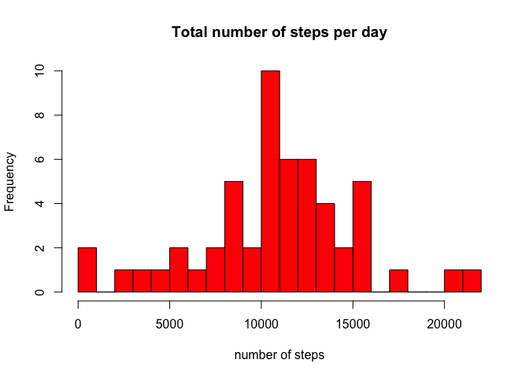
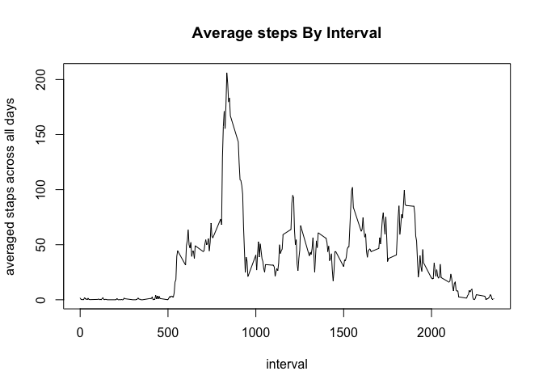
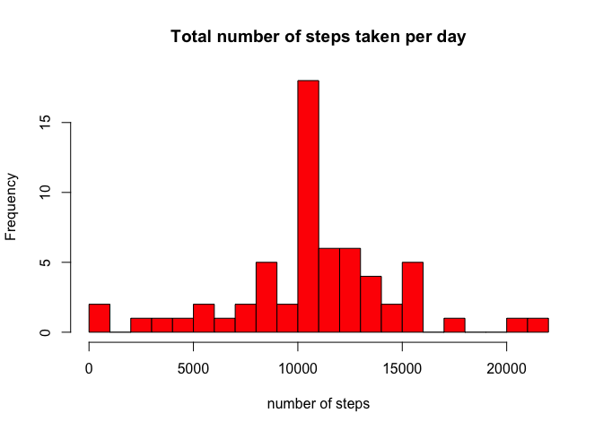
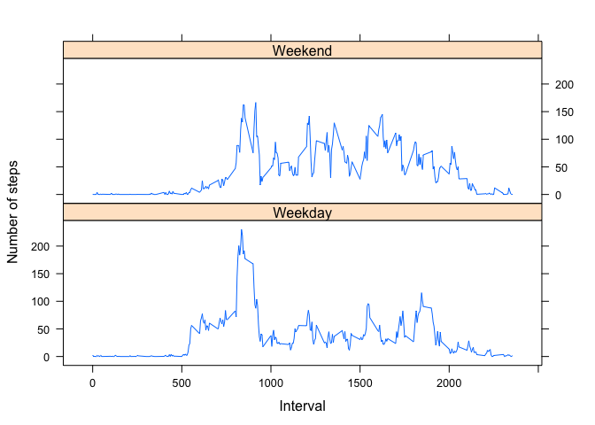

# Reproducible Research: Peer Assessment 1


```r
## Loading and preprocessing the data
# - Check if the file activity.csv exists, if not unzip the activity.zip file and Read the data in the dataframe 
if(!file.exists("activity.csv")){
      unzip("activity.zip")
}
activiteDF <- read.table("activity.csv", header = TRUE, sep = ",", quote = "\"")


## What is mean total number of steps taken per day?
# - Total number of steps taken per day
library(plyr)
library(sqldf)
totalStepsPerDay <- sqldf(" select sum(steps) as steps, date from activiteDF where steps <> 'NA' group by date")
 # - plot the histogram of the total steps par day
hist(totalStepsPerDay$steps, main="Total number of steps per day", xlab="number of steps", col="red", breaks=30)
```

\

```r
## What is mean total number of steps taken per day?
mean(totalStepsPerDay$steps)
```

```
## [1] 10766.19
```

```r
## What is the average daily activity pattern?
median(totalStepsPerDay$steps)
```

```
## [1] 10765
```

```r
## What is the average daily activity pattern?
# - Get the averages by interval 
averageStepsBy5mInterval <- sqldf("select interval, AVG(steps) as AVERAGE
                                    from activiteDF
                                    where steps <> 'NA'
                                    group BY interval")

# - Plot the average number of steps taken par interval
plot(averageStepsBy5mInterval$AVERAGE ~ averageStepsBy5mInterval$interval, type = "l", xlab = "interval", 
     ylab = "averaged staps across all days", main="Average steps By Interval" )
```

\

```r
# - Get the 5-minute interval, on average across all the days in the dataset, contains the maximum number of steps
maxStapsInterval <- sqldf("select max(AVERAGE) as maxInterval, interval
                                    from averageStepsBy5mInterval
                          GROUP BY interval order by max(AVERAGE) desc limit 1")

# - The interval with the maximum average steps
maxStapsInterval$interval
```

```
## [1] 835
```

```r
## Imputing missing values
# - Calculate and report the total number of missing values in the dataset
sum(is.na(activiteDF$steps))
```

```
## [1] 2304
```

```r
# - Devise a strategy for filling in all of the missing values in the dataset
# - I will replace all the name with the corresponding mean for that 5-minute interval using the averageStepsBy5mInterval variable
noNAdf <- activiteDF
for (i in 1:nrow(noNAdf)){
      if (is.na(noNAdf$steps[i])){
            noNAdf$steps[i] <- sqldf(paste("select AVERAGE from averageStepsBy5mInterval where interval = ", noNAdf$interval[i], collapse = ""))
      }
}

# - Make a histogram of the total number of steps taken each day and Calculate and report the mean and median total number of steps taken per day
# - get the number of steps taken per day
newNumberOfStepsParDate <- ddply(noNAdf, .(date), summarise, steps=sum(as.numeric(steps) ))
      
hist(newNumberOfStepsParDate$steps, main="Total number of steps taken per day", xlab="number of steps", col = "red", breaks = 30)
```

\

```r
# - Calculate and report the mean and median total number of steps taken per day
mean(newNumberOfStepsParDate$steps)
```

```
## [1] 10766.19
```

```r
# mean = 10766.19
median(newNumberOfStepsParDate$steps)
```

```
## [1] 10766.19
```

```r
# median = 10766.19

# - Do these values differ from the estimates from the first part of the assignment? What is the impact of imputing missing data on the estimates of the total daily number of steps?
# Only the median have a different value from the original value. Also the value of the median is now equal to the mean.
# Impact: filling the NA with the average increased the number of steps par day.

## Are there differences in activity patterns between weekdays and weekends?
# - Add the new column into the dataframe
noNAdf$dayType <- ifelse(weekdays(as.Date(noNAdf$date)) %in% c("Saturday", "Sunday"),"Weekend", "Weekday")

# - Now let's plot the time series 
library(lattice)
finalData <- ddply(noNAdf, .(interval, dayType), summarize, steps = mean(as.numeric(steps) ))
xyplot(steps ~ interval | dayType, data = finalData, type = "l", layout = c(1, 2), 
       xlab = "Interval", ylab = "Number of steps")
```

\
